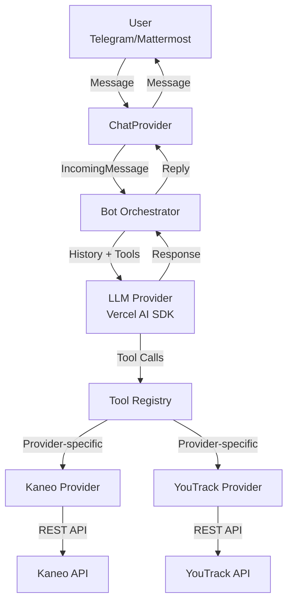

# Papai

<p align="center">Natural language task management for Telegram and Mattermost</p>

<p align="center">
  <a href="https://github.com/wKich/papai/actions/workflows/ci.yml"></a>
  <a href="https://github.com/wKich/papai/security"></a>
  <a href="LICENSE"></a>
  <a href="https://bun.sh"></a>
</p>

<p align="center">
  <a href="#quick-start">Quick Start</a> ·
  <a href="#features">Features</a> ·
  <a href="#architecture">Architecture</a> ·
  <a href="#configuration">Configuration</a> ·
  <a href="#deployment">Deployment</a>
</p>

---

## Table of Contents

- [Overview](#overview)
- [Features](#features)
- [Quick Start](#quick-start)
- [Architecture](#architecture)
- [Configuration](#configuration)
- [Usage](#usage)
- [Development](#development)
- [Testing](#testing)
- [Deployment](#deployment)
- [License](#license)

## Overview

Papai is a chat bot that enables natural language task management through any OpenAI-compatible LLM. Deploy it on Telegram or Mattermost, connect to Kaneo or YouTrack task trackers, and manage your team's work through conversational interfaces.

The bot interprets natural language requests, invokes appropriate operations through LLM tool-calling, and responds with task status, updates, and search results. Each user maintains isolated credentials, conversation history, and long-term memory for context-aware interactions.

---

## Features

| Category      | Capability                  | Description                                |
| ------------- | --------------------------- | ------------------------------------------ |
| **Tasks**     | Create, Update, Search      | Full task lifecycle with natural language  |
| **Comments**  | Add, Read, Update, Delete   | Threaded discussions on tasks              |
| **Relations** | Blocks, Duplicates, Related | Task dependencies and associations         |
| **Labels**    | Create, Apply, Remove       | Categorization and filtering               |
| **Projects**  | List, Create, Update        | Workspace organization                     |
| **Statuses**  | CRUD, Reorder               | Kanban board column management             |
| **Memory**    | Conversation, Facts         | Per-user history and knowledge persistence |

### Platform Support

| Platform       | Authentication      | Group Support             | WebSocket |
| -------------- | ------------------- | ------------------------- | --------- |
| **Telegram**   | Bot token + User ID | Full (admin/member roles) | Real-time |
| **Mattermost** | Bot account + Token | Full (admin/member roles) | Real-time |

### Task Provider Support

| Provider     | Auto-Provisioning | Relations | Labels  | Comments |
| ------------ | ----------------- | --------- | ------- | -------- |
| **Kaneo**    | Yes               | Yes       | Yes     | Yes      |
| **YouTrack** | No                | Yes       | Limited | Yes      |

---

## Quick Start

### Prerequisites

- [Bun](https://bun.sh) 1.3.11+
- Telegram bot token or Mattermost instance
- Kaneo or YouTrack instance
- OpenAI-compatible API key

### 30-Second Setup

```bash
git clone https://github.com/wKich/papai.git
cd papai
bun install
cp .env.example .env
```

Edit `.env` with your configuration:

```bash
# Required for all setups
CHAT_PROVIDER=telegram          # or: mattermost
TASK_PROVIDER=kaneo             # or: youtrack
ADMIN_USER_ID=123456789         # Your Telegram user ID

# Platform-specific
TELEGRAM_BOT_TOKEN=your_token_here
KANEO_CLIENT_URL=https://kaneo.example.com
```

Start the bot:

```bash
bun start
```

Configure credentials via chat:

```
/set llm_apikey sk-your-openai-key
/set llm_baseurl https://api.openai.com/v1
/set main_model gpt-4o
/set kaneo_apikey your-kaneo-key    # When TASK_PROVIDER=kaneo
```

---

## Architecture



### Component Overview

| Path                      | Responsibility                                  |
| ------------------------- | ----------------------------------------------- |
| `src/index.ts`            | Entry point, environment validation, migrations |
| `src/bot.ts`              | Platform-agnostic message routing               |
| `src/chat/`               | Telegram and Mattermost adapters                |
| `src/llm-orchestrator.ts` | LLM integration with tool-calling               |
| `src/tools/`              | Capability-gated tool definitions               |
| `src/providers/`          | Kaneo and YouTrack API adapters                 |
| `src/config.ts`           | Per-user runtime configuration                  |
| `src/memory.ts`           | Fact extraction and long-term storage           |
| `src/conversation.ts`     | History management with summarization           |

---

## Configuration

### Environment Variables

<details>
<summary><b>Required Variables</b> (click to expand)</summary>

| Variable        | Description           | Example                                           |
| --------------- | --------------------- | ------------------------------------------------- |
| `CHAT_PROVIDER` | Chat platform         | `telegram` or `mattermost`                        |
| `ADMIN_USER_ID` | Admin user identifier | `123456789` (Telegram) or `username` (Mattermost) |
| `TASK_PROVIDER` | Task tracker backend  | `kaneo` or `youtrack`                             |

</details>

<details>
<summary><b>Telegram Configuration</b></summary>

| Variable             | Description                               |
| -------------------- | ----------------------------------------- |
| `TELEGRAM_BOT_TOKEN` | From [@BotFather](https://t.me/BotFather) |

**Getting your Telegram user ID:**

1. Message [@userinfobot](https://t.me/userinfobot)
2. Copy the numeric ID to `ADMIN_USER_ID`

</details>

<details>
<summary><b>Mattermost Configuration</b></summary>

| Variable               | Description       |
| ---------------------- | ----------------- |
| `MATTERMOST_URL`       | Instance URL      |
| `MATTERMOST_BOT_TOKEN` | Bot account token |

**Creating a bot:**

1. Go to **Main Menu → Integrations → Bot Accounts**
2. Add bot with `System Admin` role
3. Copy token to `MATTERMOST_BOT_TOKEN`

</details>

<details>
<summary><b>Kaneo Configuration</b></summary>

| Variable           | Description        |
| ------------------ | ------------------ |
| `KANEO_CLIENT_URL` | Kaneo instance URL |

**Getting API key:**

1. Log into Kaneo web UI
2. Go to **Settings → API Keys**
3. Create and copy key
4. Alternatively: Auto-provision via `/set kaneo_apikey`

</details>

<details>
<summary><b>YouTrack Configuration</b></summary>

| Variable       | Description           |
| -------------- | --------------------- |
| `YOUTRACK_URL` | YouTrack instance URL |

**Creating a token:**

1. Go to **Profile → Account Settings → Authentication → Hub Tokens**
2. Create token with permissions:
   - Read/Create/Update issues
   - Read projects
   - Read user profile

</details>

### Runtime Configuration

Use chat commands to configure per-user settings:

| Command              | Description                |
| -------------------- | -------------------------- |
| `/config`            | View current configuration |
| `/set <key> <value>` | Set configuration value    |
| `/clear`             | Clear conversation history |

**Common Settings:**

| Key              | Description                | Example                            |
| ---------------- | -------------------------- | ---------------------------------- |
| `llm_apikey`     | LLM provider API key       | `sk-...`                           |
| `llm_baseurl`    | OpenAI-compatible endpoint | `https://api.openai.com/v1`        |
| `main_model`     | Primary model              | `gpt-4o`, `claude-3-opus-20240229` |
| `small_model`    | Memory extraction model    | `gpt-4o-mini`                      |
| `kaneo_apikey`   | Kaneo API key              | From Kaneo settings                |
| `youtrack_token` | YouTrack permanent token   | `perm:XXX...`                      |

---

## Usage

Send natural language messages to the bot:

**Task Management**

- "Create a high-priority bug: login crashes on Safari"
- "Move task 42 to In Progress"
- "Show me the details of task 55"
- "Archive task 42"

**Search and Discovery**

- "What tasks are in the Backend project?"
- "Search for timeout issues"
- "List all projects"

**Organization**

- "Add label 'urgent' to task 42"
- "Create a blocks relation: task 42 blocks task 55"
- "Create a new status called Review in Frontend"

**Comments**

- "Add a comment to task 42: Waiting for API changes"
- "Show all comments on task 55"

### Group Chat

Add the bot to Telegram groups or Mattermost channels:

1. Add bot to group/channel
2. Admin runs: `/group adduser @username`
3. Admin configures credentials via `/set`
4. Members mention: `@bot create task: fix the bug`

| Capability               | Admin | Member                 |
| ------------------------ | ----- | ---------------------- |
| User management          | Yes   | No                     |
| Configuration            | Yes   | No                     |
| Natural language queries | Yes   | Yes (mention required) |

---

## Development

All commands use `bun` directly (no `run` keyword):

```bash
# Code quality
bun lint          # Lint with oxlint
bun lint:fix      # Auto-fix lint issues
bun format        # Format with oxfmt
bun format:check  # Check formatting

# Type checking
bun typecheck     # TypeScript validation

# Security
bun security      # Run Semgrep security scan
bun security:ci   # CI scan with SARIF output

# Analysis
bun knip          # Check for unused dependencies/exports

# Testing
bun test          # Run unit tests
bun test:watch    # Watch mode
bun test:coverage # Coverage report
bun test:e2e      # E2E tests (requires Docker)

# All checks
bun check           # Run staged-only checks (used by pre-commit hook)
bun check:full      # Run full suite: lint, typecheck, format:check, knip, test, duplicates, mock-pollution
bun check:verbose   # Run full suite with verbose output
bun fix             # Auto-fix lint and format
```

No build step required. Bun runs TypeScript directly.

---

## Testing

### Unit Tests

```bash
bun test
```

Located in `tests/` mirroring `src/` structure. Excludes E2E tests by default.

### E2E Tests

```bash
bun test:e2e
```

Requires Docker. Spins up a Kaneo instance, runs full integration tests, and tears down automatically.

---

## Deployment

### Docker Compose (Recommended)

```yaml
services:
  papai:
    image: ghcr.io/wkich/papai:latest
    environment:
      CHAT_PROVIDER: telegram
      TASK_PROVIDER: kaneo
      ADMIN_USER_ID: '123456789'
      TELEGRAM_BOT_TOKEN: ${TELEGRAM_BOT_TOKEN}
      KANEO_CLIENT_URL: https://kaneo.example.com
    volumes:
      - papai-data:/data

volumes:
  papai-data:
```

### GitHub Actions

Publishing a release triggers automatic deployment:

1. Create GitHub release (e.g., `v4.2.0`)
2. Workflow builds and pushes to GHCR
3. SSH deployment to configured server

**Required Secrets:**

- `SSH_KEY` - Private SSH key
- `SSH_HOST_KEY` - Server host key
- `TELEGRAM_BOT_TOKEN`
- `ADMIN_USER_ID`

**Required Variables:**

- `SSH_HOST` - Deployment target
- `SSH_USER` - SSH username
- `SSH_PORT` - SSH port (default: 22)

### Manual (Bare Metal)

```bash
git clone https://github.com/wKich/papai.git
cd papai
bun install
cp .env.example .env
# Edit .env with your settings
bun start
```

---

## Tech Stack

- **Runtime:** [Bun](https://bun.sh) 1.3.11
- **Language:** TypeScript 5.x (strict mode)
- **Validation:** [Zod](https://zod.dev) v4
- **LLM Integration:** [Vercel AI SDK](https://sdk.vercel.ai)
- **Chat Platforms:** [Grammy](https://grammy.dev) (Telegram), Mattermost REST API
- **Task Trackers:** Kaneo REST API, YouTrack REST API
- **Database:** SQLite (Drizzle ORM)
- **Linting:** oxlint, oxfmt
- **Security:** Semgrep (OWASP Top 10, AI/LLM-specific rules)
- **Testing:** Bun Test

---

## License

[MIT](LICENSE) © 2026 Dmitriy Lazarev
