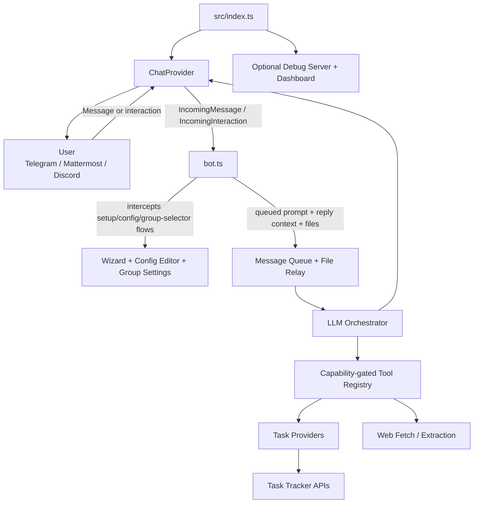

# PAPAI — Personal Adroit Proactive AI

<p align="center">
  
</p>

<p align="center">Natural language task management for Telegram, Mattermost, and Discord</p>

<p align="center">
  <a href="https://github.com/wKich/papai/actions/workflows/ci.yml"></a>
  <a href="https://github.com/wKich/papai/security"></a>
  <a href="LICENSE"></a>
  <a href="https://bun.sh"></a>
</p>

<p align="center">
  <a href="#quick-start">Quick Start</a> ·
  <a href="#features">Features</a> ·
  <a href="#architecture">Architecture</a> ·
  <a href="#configuration">Configuration</a> ·
  <a href="#deployment">Deployment</a>
</p>

---

## Table of Contents

- [Overview](#overview)
- [Features](#features)
- [Quick Start](#quick-start)
- [Architecture](#architecture)
- [Configuration](#configuration)
- [Usage](#usage)
- [Development](#development)
- [Testing](#testing)
- [Deployment](#deployment)
- [License](#license)

## Overview

Papai (**P**ersonal **A**droit **P**roactive **AI**) is a chat bot that enables natural language task management through any OpenAI-compatible LLM. Deploy it on Telegram, Mattermost, or Discord, connect it to Kaneo or YouTrack, and manage work through conversational task operations.

The bot interprets natural-language requests, invokes capability-gated tools through LLM tool-calling, and replies with task details, updates, summaries, and search results. Personal settings remain user-scoped, while DM `/setup` and `/config` can also target shared group settings for groups the user manages. Conversation history, memory, and memo storage are isolated by storage context. Telegram forum topics and Mattermost threads get separate thread-scoped context; Discord currently does not.

---

## Features

| Category             | Capability                                      | Description                                                          |
| -------------------- | ----------------------------------------------- | -------------------------------------------------------------------- |
| **Tasks**            | Create, Update, Search, List, Get, Delete       | Full task lifecycle through natural language                         |
| **Comments**         | Add, Read, Update, Delete, Reactions            | Task discussions with provider-specific reactions                    |
| **Relations**        | Blocks, Duplicates, Related, Subtask            | Cross-task dependencies and associations                             |
| **Projects**         | List, Create, Update, Delete, Team              | Workspace organization and team management                           |
| **Statuses**         | CRUD, Reorder                                   | Board/status column management                                       |
| **Labels**           | List, Create, Update, Delete, Assign            | Categorization and filtering                                         |
| **Attachments**      | List, Upload, Remove                            | Attach task files directly from chat messages where supported        |
| **Collaboration**    | Watchers, Votes, Visibility                     | Provider-dependent coordination surfaces                             |
| **Work Tracking**    | Count tasks, log work, update work, remove work | Task counts and time tracking where supported                        |
| **Identity**         | Link chat identity to tracker identity          | Enables reliable “assign to me” and similar flows in groups          |
| **History**          | Thread-aware chat history lookup                | Search the main group chat from a thread when more context is needed |
| **Web Fetch**        | Public URL fetch, summary, excerpt              | Fetch and summarize public web pages and PDFs                        |
| **Memory**           | Conversation history, summary, facts            | Context-aware multi-turn interactions                                |
| **Memos**            | Save, search, list, promote                     | Quick notes with keyword or semantic lookup                          |
| **Recurring Tasks**  | Template schedules                              | Reusable recurring task automation                                   |
| **Deferred Prompts** | One-shot, delayed, cron                         | Scheduled proactive assistance                                       |
| **Instructions**     | Context-specific guidance                       | Per-chat custom instructions                                         |

### Platform Support

| Platform       | Group Message Model                | Threads                                                                  | Command Menu | Buttons      | File Receive | File Replies | Notes                                                                                      |
| -------------- | ---------------------------------- | ------------------------------------------------------------------------ | ------------ | ------------ | ------------ | ------------ | ------------------------------------------------------------------------------------------ |
| **Telegram**   | Sees group messages directly       | Forum topics supported and can create a topic on mention in forum groups | Yes          | Yes          | Yes          | Yes          | Best support for bot command menus and forum-topic flows                                   |
| **Mattermost** | Sees group messages directly       | Thread/root-post aware                                                   | No           | No callbacks | Yes          | Yes          | Username resolution supported                                                              |
| **Discord**    | DMs plus guild-channel `@mentions` | No separate thread-scoped support today                                  | No           | Yes          | No           | No           | Uses embeds for rich `/context` output; requires Message Content intent for content access |

### Task Provider Support

| Provider     | Auto-Provisioning | Relations | Statuses | Labels | Comments | Reactions | Team | Watchers / Votes / Visibility | Attachments | Work Items | Count |
| ------------ | ----------------- | --------- | -------- | ------ | -------- | --------- | ---- | ----------------------------- | ----------- | ---------- | ----- |
| **Kaneo**    | Yes               | Yes       | Yes      | Yes    | Yes      | No        | No   | No                            | No          | No         | No    |
| **YouTrack** | No                | Yes       | Yes      | Yes    | Yes      | Yes       | Yes  | Yes                           | Yes         | Yes        | Yes   |

YouTrack task creation can require workflow-specific custom fields. Papai exposes a `customFields` input on task creation for those project-specific requirements.

---

## Quick Start

### Prerequisites

- [Bun](https://bun.sh) 1.3+
- One supported chat platform: Telegram, Mattermost, or Discord
- One supported task provider: Kaneo or YouTrack
- OpenAI-compatible API credentials for your chosen model provider

### 30-Second Setup

```bash
git clone https://github.com/wKich/papai.git
cd papai
bun install
cp .env.example .env
```

Edit `.env`:

```bash
# Required for all setups
CHAT_PROVIDER=telegram          # or: mattermost, discord
TASK_PROVIDER=kaneo             # or: youtrack
ADMIN_USER_ID=123456789         # Your platform user ID

# Platform-specific
TELEGRAM_BOT_TOKEN=your_token_here

# Provider-specific
KANEO_CLIENT_URL=https://kaneo.example.com
```

Start the bot:

```bash
bun start
```

Then configure runtime settings in chat:

1. DM the bot and run `/setup`
2. Complete the wizard for personal settings
3. Use `/config` later to review or edit settings

For groups, run `/setup` or `/config` in DM and choose either personal settings or one of the groups you manage.

---

## Architecture



### Component Overview

| Path                             | Responsibility                                                                      |
| -------------------------------- | ----------------------------------------------------------------------------------- |
| `src/index.ts`                   | Entry point, env validation, startup, scheduler and optional debug server wiring    |
| `src/bot.ts`                     | Platform-agnostic message handling, interception, queueing, and interaction routing |
| `src/chat/`                      | Telegram, Mattermost, and Discord adapters plus capability metadata                 |
| `src/llm-orchestrator.ts`        | LLM tool-calling orchestration                                                      |
| `src/tools/`                     | Context-aware, capability-gated tool assembly                                       |
| `src/providers/`                 | Kaneo and YouTrack provider adapters                                                |
| `src/identity/`                  | Chat-to-provider identity mapping and “me” resolution                               |
| `src/file-relay.ts`              | Turn-scoped incoming file relay for attachment tools                                |
| `src/message-queue/`             | Message coalescing and orderly LLM dispatch                                         |
| `src/group-settings/`            | DM-driven selection of personal vs group configuration targets                      |
| `src/web/`                       | Safe fetch, extraction, distillation, caching, and rate limiting for `web_fetch`    |
| `src/debug/` and `client/debug/` | Optional local debug server and dashboard UI                                        |

---

## Configuration

### Environment Variables

<details>
<summary><b>Required Variables</b> (click to expand)</summary>

| Variable        | Description                       | Example                                            |
| --------------- | --------------------------------- | -------------------------------------------------- |
| `CHAT_PROVIDER` | Chat platform                     | `telegram`, `mattermost`, or `discord`             |
| `ADMIN_USER_ID` | Initial authorized admin identity | Platform user ID string seen by the active adapter |
| `TASK_PROVIDER` | Task tracker backend              | `kaneo` or `youtrack`                              |

</details>

<details>
<summary><b>Telegram Configuration</b></summary>

| Variable             | Description                                         |
| -------------------- | --------------------------------------------------- |
| `TELEGRAM_BOT_TOKEN` | Bot token from [@BotFather](https://t.me/BotFather) |

To find your Telegram numeric user ID, message [@userinfobot](https://t.me/userinfobot) and copy the returned value into `ADMIN_USER_ID`.

For Mattermost and Discord, use the platform user ID string the bot receives, not a display name or `@username`.

</details>

<details>
<summary><b>Mattermost Configuration</b></summary>

| Variable               | Description         |
| ---------------------- | ------------------- |
| `MATTERMOST_URL`       | Mattermost base URL |
| `MATTERMOST_BOT_TOKEN` | Bot account token   |

</details>

<details>
<summary><b>Discord Configuration</b></summary>

| Variable            | Description                                 |
| ------------------- | ------------------------------------------- |
| `DISCORD_BOT_TOKEN` | Bot token from the Discord developer portal |

Discord support uses gateway intents including `MessageContent`. Enable the **Message Content Intent** for the bot in the Discord developer portal if you expect the bot to read message content beyond explicit interaction payloads. Verified applications must also enable the privileged Message Content intent in the portal for non-empty content, attachments, embeds, and similar fields.

</details>

<details>
<summary><b>Kaneo Configuration</b></summary>

| Variable             | Description                                        |
| -------------------- | -------------------------------------------------- |
| `KANEO_CLIENT_URL`   | Public Kaneo client URL                            |
| `KANEO_INTERNAL_URL` | Optional internal API URL for bot-to-Kaneo traffic |

Kaneo can auto-provision user accounts for the bot workflow. In self-hosted deployments, `docker-compose.yml` also expects Kaneo-specific database/auth variables such as `KANEO_POSTGRES_PASSWORD` and `KANEO_AUTH_SECRET`.

</details>

<details>
<summary><b>YouTrack Configuration</b></summary>

| Variable       | Description           |
| -------------- | --------------------- |
| `YOUTRACK_URL` | YouTrack instance URL |

Runtime setup still requires a per-user `youtrack_token`, configured through the bot.

</details>

<details>
<summary><b>Optional Debug Server</b></summary>

| Variable         | Description                                        |
| ---------------- | -------------------------------------------------- |
| `DEBUG_SERVER`   | Set to `true` to start the local debug server      |
| `DEBUG_HOSTNAME` | Debug server bind host (default `127.0.0.1`)       |
| `DEBUG_PORT`     | Debug server bind port (default `9100`)            |
| `DEBUG_TOKEN`    | Optional bearer token required for debug endpoints |

</details>

### Runtime Configuration

Use the bot’s DM-based configuration flow:

| Command    | Description                                                            |
| ---------- | ---------------------------------------------------------------------- |
| `/setup`   | Run the guided configuration wizard                                    |
| `/config`  | View current settings and edit fields interactively where supported    |
| `/clear`   | Clear conversation history, summary, and facts for the current context |
| `/context` | View the current LLM context window for this conversation              |

Runtime keys shown by `/setup` and `/config` include:

| Key               | Description                                                 |
| ----------------- | ----------------------------------------------------------- |
| `llm_apikey`      | LLM provider API key                                        |
| `llm_baseurl`     | OpenAI-compatible base URL                                  |
| `main_model`      | Main model used for task orchestration                      |
| `small_model`     | Smaller model used by features such as group-history lookup |
| `embedding_model` | Embedding model for semantic memo search                    |
| `kaneo_apikey`    | Kaneo API key or session token                              |
| `youtrack_token`  | YouTrack permanent token                                    |
| `timezone`        | User timezone for local date/time interpretation            |

---

## Usage

Send natural-language requests to the bot.

**Task Management**

- "Create a high-priority bug: login crashes on Safari"
- "Move task 42 to In Progress"
- "Show me task PROJ-55"
- "Delete task 42"

**Comments and Relations**

- "Add a comment to task 42: waiting for API changes"
- "Show all comments on task 55"
- "Create a blocks relation: task 42 blocks task 55"

**Identity and Assignment**

- "I'm jsmith"
- "Assign this to me"
- "Add me as a watcher"

**Attachments and Web Fetch**

- Send a file with: "Attach this screenshot to task 42"
- "Fetch https://example.com/release-notes and summarize the breaking changes"

**Memos and History**

- "Save a memo: renew the SSL certificate before Friday"
- "Search my memos for certificate"
- "Look up what we decided about alert thresholds in the main chat"

### Group Chat

Add the bot to a Telegram group, Mattermost channel, or Discord server/channel.

Typical flow:

1. Add the bot to the group or channel
2. A group admin authorizes members with `/group adduser <@username>` or an explicit user ID
3. Group admins configure group settings from DM using `/setup` or `/config`
4. Members interact in-group, usually by mention where the platform requires it

Important behavior:

- Telegram and Mattermost can observe regular group messages; Discord group use is mention-driven.
- Group configuration is DM-only. `/setup` and `/config` in groups redirect admins to DM.
- Thread contexts are isolated. In Telegram forum topics and Mattermost threads, the bot stores thread-scoped history separately from the main group chat.
- In thread-scoped group contexts, the bot can use `lookup_group_history` to search the main group discussion when needed.

---

## Development

All commands can be run as `bun <script>` or `bun run <script>`.

```bash
# App and debug UI
bun start
bun start:debug
bun build:client

# Code quality
bun lint
bun lint:fix
bun lint:agent-strict -- src/file.ts tests/file.test.ts
bun format
bun format:check
bun typecheck
bun knip
bun duplicates

# Security
bun security
bun security:ci

# Testing
bun test
bun test:client
bun test:watch
bun test:coverage
bun test:e2e
bun test:e2e:watch
bun test:mutate
bun test:mutate:changed
bun test:mutate:full

# Composite checks
bun check
bun check:full
bun check:verbose
bun fix

# Release helpers
bun changelog:preview
bun changelog:generate
```

Notes:

- `bun start` builds the dashboard client first, then starts the bot.
- `bun start:debug` also enables the local debug server.
- `bun test` excludes client and E2E suites; run `bun test:client` and `bun test:e2e` separately.
- `bun check` runs staged-file checks, while `bun check:full` runs the wider repo checks.

---

## Testing

### Unit and Integration Tests

```bash
bun test
```

Runs the curated main Bun test suites defined in `package.json` for the repo’s non-client, non-E2E areas.

### Client Tests

```bash
bun test:client
```

Runs debug dashboard UI tests under `tests/client/` with happy-dom.

### E2E Tests

```bash
bun test:e2e
```

Runs the Docker-backed Kaneo end-to-end suite.

### Mutation Testing

```bash
bun test:mutate:changed
```

Runs incremental mutation testing with Stryker. Full mutation runs are also available via `bun test:mutate` and `bun test:mutate:full`.

---

## Deployment

### Docker Compose (Recommended for self-hosted Kaneo deployments)

The repository includes a production-oriented `docker-compose.yml` that runs:

- `papai`
- Kaneo API and web
- PostgreSQL
- a one-shot Kaneo DB fix container
- Caddy for TLS and reverse proxying

Minimal example:

```yaml
services:
  papai:
    image: ghcr.io/wkich/papai:latest
    environment:
      CHAT_PROVIDER: telegram
      TASK_PROVIDER: kaneo
      ADMIN_USER_ID: '123456789'
      TELEGRAM_BOT_TOKEN: ${TELEGRAM_BOT_TOKEN}
      KANEO_CLIENT_URL: https://kaneo.example.com
```

For a real deployment, prefer the checked-in `docker-compose.yml` and `.env.example` together, because the full stack is Kaneo-specific and also needs Kaneo database/auth settings. For YouTrack deployments, you typically run `papai` against an external YouTrack instance instead of this full bundled stack.

### GitHub Actions Deployment

The repo currently uses:

- `release.yml` to bump version, update `package.json`, generate `CHANGELOG.md`, and create a GitHub release
- `deploy.yml` to build/push the container and deploy over SSH on version tags or successful release workflow completion

Current deployment automation is opinionated for the Telegram + Kaneo production path. If you deploy Mattermost, Discord, or YouTrack in production, adapt the workflow and `.env` generation accordingly.

### Manual (Bare Metal)

```bash
git clone https://github.com/wKich/papai.git
cd papai
bun install
cp .env.example .env
# Edit .env
bun start
```

If you want the local debug dashboard too:

```bash
bun start:debug
```

---

## Tech Stack

- **Runtime:** [Bun](https://bun.sh) 1.3+
- **Language:** TypeScript (strict mode)
- **Validation:** [Zod](https://zod.dev) v4
- **LLM Integration:** [Vercel AI SDK](https://sdk.vercel.ai)
- **Chat Platforms:** [Grammy](https://grammy.dev), Mattermost REST/WebSocket, [discord.js](https://discord.js.org)
- **Task Trackers:** Kaneo REST API, YouTrack REST API
- **Database:** SQLite with Drizzle ORM
- **Web Extraction:** defuddle, linkedom, unpdf
- **Linting / Formatting:** oxlint, oxfmt
- **Security:** Semgrep
- **Testing:** Bun Test, happy-dom, Stryker, Docker-backed E2E

---

## License

[MIT](LICENSE) © 2026 Dmitriy Lazarev
