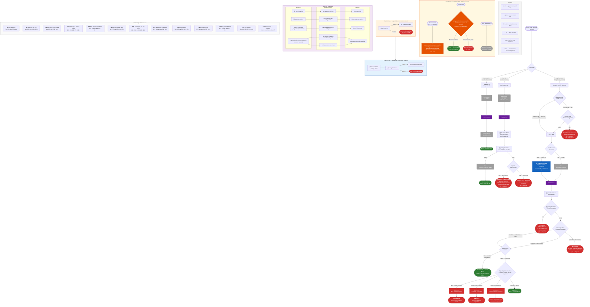

# TDD Hook Pipelines — Mermaid Diagram

Complete visual representation of all 12 scenarios from [PIPELINES.md](./PIPELINES.md).

```mermaid
flowchart TD
    %% ━━━━━━━━━━━━━━━━━━━━━━━━━━━━━━━━━━━━━━━━━━━━━━━━━
    %% LEGEND
    %% ━━━━━━━━━━━━━━━━━━━━━━━━━━━━━━━━━━━━━━━━━━━━━━━━━
    subgraph legend [" Legend "]
        direction LR
        L1["⊘ skip — guard returns null early"]
        L2["→ pass — check returns null"]
        L3["✗ BLOCK — check returns block"]
        L4["— n/a — short-circuited"]
        L5["snap — writes state snapshot"]
        L6["base — session-level baseline captured"]
    end

    %% ━━━━━━━━━━━━━━━━━━━━━━━━━━━━━━━━━━━━━━━━━━━━━━━━━
    %% MAIN PIPELINE
    %% ━━━━━━━━━━━━━━━━━━━━━━━━━━━━━━━━━━━━━━━━━━━━━━━━━
    START(["Write / Edit / MultiEdit<br/>tool call"]) --> CLASSIFY{"Classify file"}

    %% ─── FILE CLASSIFICATION ───────────────────────────
    CLASSIFY -->|"Outside src/, or<br/>non-TS/JS extension"| S1
    CLASSIFY -->|"Test file<br/>(*.test.* / *.spec.*)"| TEST_PATH
    CLASSIFY -->|"Impl file in src/<br/>(*.ts/js/tsx/jsx, not test)"| IMPL_PATH

    %% ━━━━━━━━━━━━━━━━━━━━━━━━━━━━━━━━━━━━━━━━━━━━━━━━━
    %% SCENARIO 1 — Non-gated file
    %% ━━━━━━━━━━━━━━━━━━━━━━━━━━━━━━━━━━━━━━━━━━━━━━━━━
    S1["<b>Scenario 1</b><br/>Non-gated file"]
    S1 --> S1_PRE["PreToolUse:<br/>[1] ⊘  [2] ⊘"]
    S1_PRE --> S1_WRITE["File is written"]
    S1_WRITE --> S1_POST["PostToolUse:<br/>[4] ⊘  [5] ⊘  [6] ⊘"]
    S1_POST --> S1_DONE(["Pass — no work done"])

    %% ━━━━━━━━━━━━━━━━━━━━━━━━━━━━━━━━━━━━━━━━━━━━━━━━━
    %% TEST FILE PATH — Scenarios 3, 11
    %% ━━━━━━━━━━━━━━━━━━━━━━━━━━━━━━━━━━━━━━━━━━━━━━━━━
    TEST_PATH["Test file detected"]
    TEST_PATH --> TF_PRE["PreToolUse:<br/>[1] ⊘  [2] ⊘<br/><i>isTestFile → true</i>"]
    TF_PRE --> TF_WRITE["File is written"]
    TF_WRITE --> TF_TRACK["<b>[4] trackTestWrite</b><br/>Save test path to<br/>session state file"]
    TF_TRACK --> TF_VERIFY["<b>[5] verifyTestsPass</b><br/>bun test &lt;this test file&gt;"]

    TF_VERIFY -->|PASS| TF_S11_PASS["[6] ⊘<br/><i>isTestFile bypasses guard</i>"]
    TF_S11_PASS --> TF_DONE(["<b>Scenario 11</b><br/>Pass — test edit OK"])

    TF_VERIFY -->|FAIL| TF_NEW{"Impl file<br/>exists on disk?"}
    TF_NEW -->|"NO — impl missing"| TF_S3(["<b>Scenario 3 — Red Phase</b><br/>BLOCK: Tests fail<br/><i>Write the implementation<br/>to make this test pass</i><br/>[6] — skipped"])
    TF_NEW -->|"YES — impl exists"| TF_S11_FAIL(["<b>Scenario 11 — Test broke</b><br/>BLOCK: Tests fail<br/><i>Fix the test</i><br/>[6] — skipped"])

    %% ━━━━━━━━━━━━━━━━━━━━━━━━━━━━━━━━━━━━━━━━━━━━━━━━━
    %% IMPL FILE PATH — Scenarios 2, 4, 5, 6, 7, 8, 9, 10
    %% ━━━━━━━━━━━━━━━━━━━━━━━━━━━━━━━━━━━━━━━━━━━━━━━━━
    IMPL_PATH["Gateable impl file detected"]

    %% ── CHECK [1] — enforceTdd ─────────────────────────
    IMPL_PATH --> C1{"<b>[1] enforceTdd</b><br/>Test file exists?"}
    C1 -->|"findTestFile → found on disk"| C1_PASS["[1] → Pass"]
    C1 -->|"findTestFile → null"| C1_SESSION{"Session state<br/>has matching test?"}
    C1_SESSION -->|YES| C1_PASS
    C1_SESSION -->|"NO"| S2(["<b>Scenario 2</b><br/>BLOCK: No test file exists<br/><i>Write a failing test first</i><br/>[2] — skipped<br/>File NOT written"])

    %% ── CHECK [2] — Snapshot ───────────────────────────
    C1_PASS --> FILE_NEW{"Impl file exists<br/>on disk?"}
    FILE_NEW -->|"NO — new file"| SNAP_SKIP["[2] ⊘<br/><i>Nothing to snapshot</i>"]
    FILE_NEW -->|"YES — existing file"| SNAP_SURFACE

    SNAP_SURFACE["<b>[2] snapshotSurface</b><br/>Capture exports, signatures,<br/>line coverage → snapshot file"]

    SNAP_SURFACE --> IMPL_WRITE
    SNAP_SKIP --> IMPL_WRITE

    IMPL_WRITE["File is written"]

    %% ── PostToolUse ─────────────────────────────────────
    IMPL_WRITE --> POST_TRACK["[4] trackTestWrite ⊘<br/><i>Not a test file</i>"]

    %% ── CHECK [5] — verifyTestsPass ────────────────────
    POST_TRACK --> C5{"<b>[5] verifyTestsPass</b><br/>bun test &lt;test file&gt;"}
    C5 -->|FAIL| S6(["<b>Scenario 6</b><br/>BLOCK: Tests fail<br/><i>Fix the code to make<br/>the tests pass</i><br/>[6] — skipped"])

    C5 -->|PASS| COV{"Coverage check<br/>(vs session baseline)"}
    COV -->|"New file → no baseline → skip"| SURFACE_CHECK
    COV -->|"currentPct >= baselinePct"| SURFACE_CHECK
    COV -->|"currentPct < baselinePct"| S9(["<b>Scenario 9</b><br/>BLOCK: Coverage dropped<br/><i>Before: X% → After: Y%</i><br/>[6] — skipped"])

    %% ── CHECK [6] — Surface ────────────────────────────
    SURFACE_CHECK{"Snapshot file<br/>exists?"}
    SURFACE_CHECK -->|"NO — new file<br/>(Scenario 4)"| S4_DONE(["<b>Scenario 4 — Green Phase</b><br/>Pass — all checks green<br/>[6] ⊘"])

    SURFACE_CHECK -->|"YES — existing file"| C6

    C6{"<b>[6] verifyNoNewSurface</b><br/>Compare against pre-edit snapshot"}
    C6 -->|"New exports detected"| C6_BLOCK["[6] BLOCK:<br/>New untested exports"]
    C6 -->|"Param count increased"| C6_BLOCK_SIG["[6] BLOCK:<br/>Signature expanded"]
    C6 -->|"More uncovered lines"| C6_BLOCK_COV["[6] BLOCK:<br/>Uncovered lines increased"]
    C6 -->|"All same → Pass"| S5(["<b>Scenario 5</b><br/>Pass — clean refactor"])

    C6_BLOCK --> S7A(["<b>Scenario 7A</b><br/>BLOCK: New untested exports"])
    C6_BLOCK_SIG --> S8(["<b>Scenario 8</b><br/>BLOCK: Signature expanded"])
    C6_BLOCK_COV --> S7_COV(["BLOCK: Uncovered lines<br/>increased vs pre-edit"])

    %% ── SCENARIO 7B ANNOTATION ──────────────────────────
    %% Scenario 7B: new export causes coverage drop in [5]
    %% → short-circuits to Scenario 9 path before [6] runs

    %% ━━━━━━━━━━━━━━━━━━━━━━━━━━━━━━━━━━━━━━━━━━━━━━━━━
    %% SESSION-LEVEL MUTATION TESTING — Scenario 12
    %% ━━━━━━━━━━━━━━━━━━━━━━━━━━━━━━━━━━━━━━━━━━━━━━━━━
    subgraph session_mutation [" Scenario 12 — Session-Level Mutation Testing "]
        direction TB
        SM_START(["Session Start<br/>(first PreToolUse)"]) --> SM_BASELINE["<b>captureSessionMutationBaseline</b><br/>Run Stryker on all src/**/*.ts<br/>Record surviving mutants<br/>→ tdd-session-mutation-baseline-&lt;id&gt;.json"]
        SM_END(["Session Stop"]) --> SM_VERIFY{"<b>verifySessionMutationBaseline</b><br/>Run Stryker again on all src/**/*.ts<br/>Compare final vs baseline"}
        SM_VERIFY -->|"No new survivors"| SM_PASS(["Pass — no untested<br/>code paths added"])
        SM_VERIFY -->|"New survivors found"| SM_BLOCK(["Report violations<br/>to stderr"])
        SM_MUTATION_OFF(["TDD_MUTATION=0"]) --> SM_SKIP(["Session mutation<br/>verification skipped"])
    end

    %% ━━━━━━━━━━━━━━━━━━━━━━━━━━━━━━━━━━━━━━━━━━━━━━━━━
    %% SHORT-CIRCUIT LOGIC
    %% ━━━━━━━━━━━━━━━━━━━━━━━━━━━━━━━━━━━━━━━━━━━━━━━━━
    subgraph pre ["PreToolUse — sequential, short-circuit on block"]
        direction LR
        P1["[1] enforceTdd"] -->|pass| P2["[2] snapshotSurface"]
        P1 -->|"BLOCK"| P_STOP(["EXIT — file not written<br/>[2] never called"])
    end

    subgraph post ["PostToolUse — sequential, short-circuit on block"]
        direction LR
        Q4["[4] trackTestWrite<br/><i>(always runs)</i>"] --> Q5["[5] verifyTestsPass"]
        Q5 -->|pass| Q6["[6] verifyNoNewSurface"]
        Q5 -->|"BLOCK"| Q_STOP(["EXIT — [6] never called"])
    end

    pre --> post

    %% ━━━━━━━━━━━━━━━━━━━━━━━━━━━━━━━━━━━━━━━━━━━━━━━━━
    %% STATE FILE DATA FLOW
    %% ━━━━━━━━━━━━━━━━━━━━━━━━━━━━━━━━━━━━━━━━━━━━━━━━━
    subgraph dataflow [" State File Data Flow "]
        direction LR
        subgraph writes ["Written by"]
            W4["[4] trackTestWrite"]
            W2["[2] snapshotSurface"]
            W5["[5] verifyTestsPass<br/><i>(lazy, once per session)</i>"]
            WSM["captureSessionMutationBaseline<br/><i>(once per session)</i>"]
        end

        subgraph files [".hooks/sessions/"]
            F_SESSION["tdd-session-&lt;id&gt;.json"]
            F_SNAPSHOT["tdd-snapshot-&lt;id&gt;-&lt;key&gt;.json"]
            F_BASELINE["tdd-coverage-baseline-&lt;id&gt;.json"]
            F_MUTATION["tdd-session-mutation-baseline-&lt;id&gt;.json"]
            F_STRYKER["stryker-session-&lt;id&gt;-*.json"]
        end

        subgraph reads ["Read by"]
            R1["[1] enforceTdd"]
            R6["[6] verifyNoNewSurface"]
            R5["[5] verifyTestsPass"]
            RSM["verifySessionMutationBaseline"]
        end

        W4 --> F_SESSION --> R1
        W2 --> F_SNAPSHOT --> R6
        W5 --> F_BASELINE --> R5
        WSM --> F_MUTATION --> RSM
        WSM --> F_STRYKER --> RSM
    end

    %% ━━━━━━━━━━━━━━━━━━━━━━━━━━━━━━━━━━━━━━━━━━━━━━━━━
    %% SCENARIO QUICK-REFERENCE
    %% ━━━━━━━━━━━━━━━━━━━━━━━━━━━━━━━━━━━━━━━━━━━━━━━━━
    subgraph scenarios [" Scenario Quick-Reference "]
        direction TB
        SC1["<b>S1</b>  Non-gated file<br/>[1]⊘ [2]⊘ [4]⊘ [5]⊘ [6]⊘"]
        SC2["<b>S2</b>  New impl, no test<br/>[1]✗ [2]— [4]— [5]— [6]—"]
        SC3["<b>S3</b>  Write test — Red phase<br/>[1]⊘ [2]⊘ [4]→ [5]✗ [6]—"]
        SC4["<b>S4</b>  Write impl — Green phase<br/>[1]→ [2]⊘ [4]⊘ [5]→ [6]⊘"]
        SC5["<b>S5</b>  Edit impl, clean refactor<br/>[1]→ [2]snap [4]⊘ [5]→ [6]→"]
        SC6["<b>S6</b>  Edit impl, breaks tests<br/>[1]→ [2]snap [4]⊘ [5]✗ [6]—"]
        SC7A["<b>S7A</b> New export, no cov drop<br/>[1]→ [2]snap [4]⊘ [5]→ [6]✗"]
        SC7B["<b>S7B</b> New export, cov drops<br/>[1]→ [2]snap [4]⊘ [5]✗ [6]—"]
        SC8["<b>S8</b>  Sig expansion<br/>[1]→ [2]snap [4]⊘ [5]→ [6]✗"]
        SC9["<b>S9</b>  Coverage drops<br/>[1]→ [2]snap [4]⊘ [5]✗ [6]—"]
        SC10["<b>S10</b> TDD_MUTATION=0<br/>[1]→ [2]snap [4]⊘ [5]→ [6]→"]
        SC11["<b>S11</b> Edit test file<br/>[1]⊘ [2]⊘ [4]→ [5]→/✗ [6]⊘"]
        SC12["<b>S12</b> Session stop — mutation<br/>Stryker baseline vs final diff"]
    end

    %% ━━━━━━━━━━━━━━━━━━━━━━━━━━━━━━━━━━━━━━━━━━━━━━━━━
    %% STYLING
    %% ━━━━━━━━━━━━━━━━━━━━━━━━━━━━━━━━━━━━━━━━━━━━━━━━━
    classDef block fill:#d32f2f,stroke:#b71c1c,color:#fff
    classDef pass fill:#2e7d32,stroke:#1b5e20,color:#fff
    classDef skip fill:#9e9e9e,stroke:#616161,color:#fff
    classDef snap fill:#1565c0,stroke:#0d47a1,color:#fff
    classDef write fill:#6a1b9a,stroke:#4a148c,color:#fff
    classDef session fill:#e65100,stroke:#bf360c,color:#fff

    class S2,S6,S9,TF_S3,TF_S11_FAIL,S7A,S8,S7_COV,C6_BLOCK,C6_BLOCK_SIG,C6_BLOCK_COV,P_STOP,Q_STOP,SM_BLOCK block
    class S1_DONE,TF_DONE,S4_DONE,S5,SM_PASS pass
    class S1_PRE,S1_POST,TF_PRE,TF_S11_PASS,SNAP_SKIP,SM_SKIP skip
    class SNAP_SURFACE snap
    class S1_WRITE,TF_WRITE,IMPL_WRITE write
    class SM_BASELINE,SM_VERIFY session

    style legend fill:#f5f5f5,stroke:#999
    style pre fill:#fff3e0,stroke:#e65100
    style post fill:#e3f2fd,stroke:#0d47a1
    style dataflow fill:#f3e5f5,stroke:#6a1b9a
    style scenarios fill:#fafafa,stroke:#999
    style session_mutation fill:#fff8e1,stroke:#e65100
```
